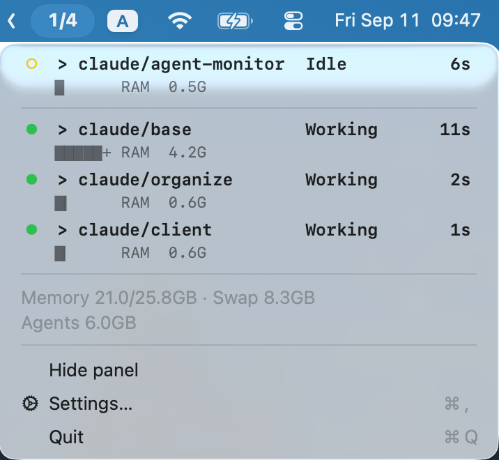
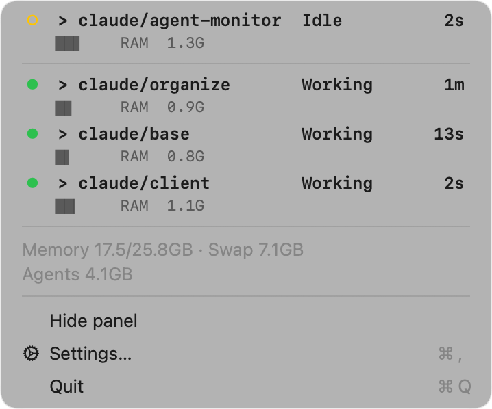
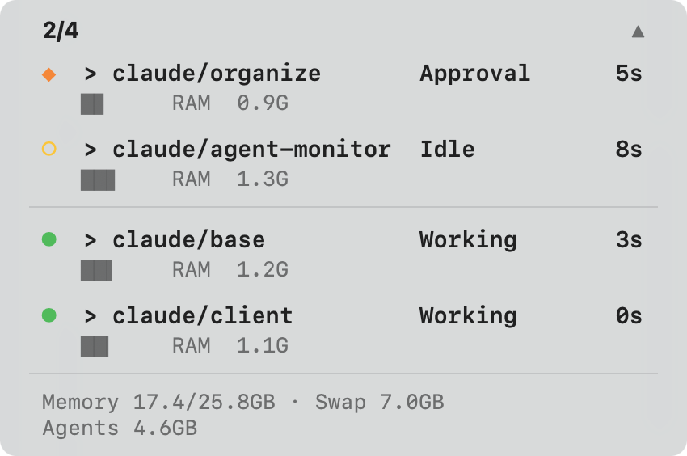
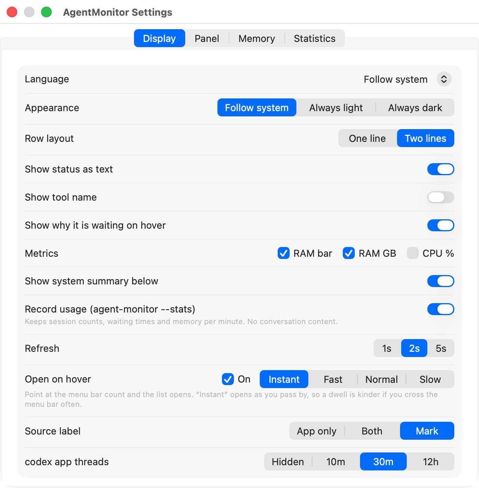

# agent-monitor

[English](README.md) | [한국어](README.ko.md) | **日本語**

**どのセッションが自分を待っているのか。**

エージェントのセッションをいくつも開いたまま使う人のための macOS メニューバーアプリです。
Claude Code でも codex でも、ターミナルでもデスクトップアプリでも。難しいのは
*何をしているのか* ではなく、**どれが終わって自分を待っているのか** です。

<p align="center">
  
</p>

---

## 何が見えるのか

メニューバーに出るのは `2/5` — 待っているのが二つ、生きているのが五つ。それだけです。
**セッションがいくつ増えても幅は伸びず、リストが切り捨てられることもありません。**


待っているものが無ければ `0/4` になり、**数字そのものが静かになります** — 答えるべきものが
無い間は淡く描かれ、生まれた瞬間に本来の濃さに戻ります。


クリックすれば、すべてのセッションが一画面に収まります。折りたたみ無し、手が要るものが上に：

```
◆  payments-api     承認待ち   Bash    2m      █▎   RAM  0.6G  CPU   0%
○  docs-site        入力待ち   —      20m      ▊    RAM  0.4G  CPU   0%
──────────────────────────────────────────────────────────────────────
●  web-client       実行中     Read    4s      █▌   RAM  0.8G  CPU  12%
◐  data-pipeline    シェル実行 Bash   31s      █▍   RAM  0.7G  CPU   3%
──────────────────────────────────────────────────────────────────────
メモリ 15.6/25.8GB · スワップ 12.3GB
エージェント 3.7GB
```

実機での同じリスト。二行レイアウトで、出所の印を出した状態：



| 印 | 状態 | 手が要るか |
|---|---|---|
| `◆` | `waiting` — 許可のプロンプトが開いている | **要る** |
| `○` | `idle` — ターンが終わり、入力を待っている | **要る** |
| `●` | `busy` — 生成中 | 不要 |
| `◐` | `shell` — シェルコマンドを実行中 | 不要 |

状態は **Claude Code が自分自身のために書いているファイル**から読みます。ファイルの更新時刻から
推測しないので、**承認待ちと長く回るシェルコマンドが区別されます** — 推測ではどちらもただ
静かに見えるだけです。

**見ているのは四か所で、数えるときは一つのリストです。** どこから来た行かは名前が背負います。

| 出所 | 状態をどこから読むか | クリックで行く先 |
|---|---|---|
| ターミナルの Claude Code | 自分で書くレジストリ | そのターミナルの窓 |
| Claude デスクトップアプリ | 記録の末尾から — **推定** | 無し。ターミナルがありません |
| ターミナルの codex | 記録の末尾から — **推定** | そのターミナルの窓 |
| ChatGPT アプリの codex スレッド | 自分で書くスレッド DB | そのスレッド（ディープリンク） |

**何も書き残さない二つは断定せず推定にとどめ、その行は「推定」と告げます** — 測った値のふりを
しません。アプリのスレッドは自分のプロセスを持たず（一つのアプリが全部を回します）、メモリも
CPU も載せられません — トークンは載ります。codex が自分で書き残す値だからです。しかも
終わったスレッドがまだ開いているかを知る術がないので、**最近の
窓の内側で終わったものだけ**を並べます。その窓は「表示」で選べます（10分・30分・12時間・非表示）。

出所を名前に**どう書くか**も「表示」で選べます — `claude` / `claude-app`、四つとも自分が何かを
言う `claude-cli` / `claude-app`、あるいは一桁分だけ使う印 `>`（ターミナル）・`□`（アプリ）。

**トークンを数える列が二つあり、どちらも既定では消えています。** 点けると行が 25 桁広がるので、
すでに馴染んだ幅が更新しただけで変わってしまわないようにしてあります。

```
●  web-client       Working    Read    4s      █▌   RAM  0.8G  CTX 512k  TOK 640k/ 96M
○  docs-site        Idle       —      20m      ▊    RAM  0.4G  CTX  88k  TOK  91k/ 12M
```

`CTX` は**今どれだけ埋まっているか** — 最後のターンが抱えて入った量です。`TOK` は始まってから
**焼いた量**で、**«新しく焼いた分 / 全部»** と書きます。前はキャッシュから読み直した分を除き、
後ろはそれまで数えます。片方だけではどちらを選んでも誤解を招きます — 実測したあるセッションは
一方で 17.2M、もう一方で 81.9M でした。だから二つ並べて出します。

出所ごとに書き残すものが違います。codex は累計を自分の記録に**そのつど書き直す**ので、末尾を
読めば足ります。Claude Code はターンごとの使用量しか書かないため記録を丸ごと読む必要があり、
だから `TOK` にだけ別のスイッチがあります — 消してあれば何も走査しません。アプリは**どこまで
読んだかを覚えていて、増えた分だけ**読みます。その代償は一度きりです（実測で記録 66MB に
0.30 秒、以降の更新は計れないほど速い）。サブエージェントも数えます — 自分の記録をセッションの
隣に置いており、外すとセッションのトークンの 1% から三分の一までが消えました。

`CTX` の横に**分母は書きません。** codex はコンテキスト窓の大きさを記録に書きますが Claude Code
は書かず、モデル名の表でその穴を埋めると新しいモデルが出た日から黙って違う分母が出ます。
`--json` はスイッチに関わらず三つを `contextTokens`・`freshTokens`・`totalTokens` として出します。

手が要る行に**ポインタを載せると、なぜ待っているのか**が出ます。承認待ちなら待っている呼び出しを
（`Bash: pnpm build --filter web`）、入力待ちなら最後に言ってきたことを見せます
（`Shall I commit, or leave it for the review?`）。実行中の行は何も言いません — まだ答えるものが
無いからです。

**行の中ではなくホバーに置いたのは、わざとです。** 行に置くと、言うことの無い「実行中」の行にまで
幅を払わせることになり、それでいて肝心の理由は幅に合わせて切られ、**問いの末尾** — 何を選べと
言っているのか — が消えていました。ホバーなら幅を食わず、切られもしません。この文言はアプリが
既に読んでいた記録から取り出すので新しい仕事が増えず、見つからなければ推測せず何も出しません。
コマンドが画面に出るのが嫌なら「表示」で切れますし、`--json` には `reason` として入ります。

行をクリックすると、そのセッションが回っているターミナルの窓が前に出ます。

行を**右クリックするとピン留め**できます。留めたセッションは手を待っている間ほかより上に上がり、
背景がうっすら付きます。実行中は元の位置のままです — まだ手を出すことが無いからです。
ピンはそのセッションと共に生きます。セッションを開き直したら、また留めてください。

**一つのセッションがプロセス二つにまたがっても一行です。** Claude Code はセッションを別の
プロセスへ引き継ぎながら、**ターミナルの窓は元のプロセスに残します。** すると二つはちょうど
反対向きに壊れます — 窓を持つ側は状態が引き継いだ時刻で止まり（実測で3時間半）、仕事をしている
側には行くべき窓がありません。アプリは記録に残った引き継ぎをたどって二つを繋ぎ、**生きている
状態と本物のターミナルを同じ行に**置きます。プロセスの木が重なるので、メモリは一度だけ数えます。

## 出したままにする

画面に余裕があるなら、リストを隅に貼り付けておけます。メニューバー → **パネルを表示**。

メニューバーの代わりではありません。`2/5` はそのまま残り、画面が狭いところでは開かなければ
済みます。変わるのは **クリックの一回が消える**ことだけです。

行はメニューに出ていたその行です。同じコードで描くので、「表示」で合わせた列がそのまま来ます。

```
 2/5                                                            ▲
 ◆  payments-api     承認待ち   Bash    2m      █▎   RAM  0.6G
 ○  docs-site        入力待ち   —      20m      ▊    RAM  0.4G
 ────────────────────────────────────────────────────────────────
 ●  web-client       実行中     Read    4s      █▌   RAM  0.8G
 ◐  data-pipeline    シェル実行 Bash   31s      █▍   RAM  0.7G
 ────────────────────────────────────────────────────────────────
 メモリ 15.6/25.8GB · スワップ 12.3GB
 エージェント 3.7GB
```



**クリックしても前を奪いません。** 行を押してそのターミナルへ行く場合を除けば、使っていた
エディタが前に残ります。このアプリは Dock アイコンを持たないので、一度前に出ると戻る道が
無いからです。

**本体のどこを掴んで引いても**動かせ、その位置は覚えられます。大きさは中身に合わせて変わりますが、
**貼り付けた隅は守ります** — 右下に置いたなら、セッションが増えると上へ伸びます。画面の高さを
越えるほど増えたときだけ、窓の中でスクロールします。

**ヘッダ（`2/5`）を右クリック**すると取っ手が出ます。右上の `▲`・`△` が、いま最前面かどうかを
教えます。

| 取っ手 | すること |
|---|---|
| 常に最前面 | 切ると普通の窓のように背後へ沈みます。戻す扉はメニューバーにあります |
| 待ちだけ | 手が要る行だけを残し、窓もその分だけ狭くなります |
| 閉じる | メニューバーの **パネルを隠す** と同じです |

**バックグラウンドのセッションはここから止められます。** クリックしてもどこへも行けなかった
その行 — daemon が pty を握っていて、行くべきターミナルの窓がそもそも無い行 — を右クリックすると、
止めるかを訊いてきます。行けない行と止められる行が**ちょうど同じ集合**で、手の出しようが無かった
その行に、ようやくできることが生まれます。

プロセスを殺さず CLI に頼みます（`claude stop`）。記録が書きかけで切れることなく会話も残り、
`claude attach <id>` でまた開けます。畳んでいる間は指標のあった場所に **止めています…** が出て、
終わると行がリストから消えます。

**見た目は 設定 → パネル で選べます。** 背景板はぼかしか単色、濃さは0%まで落とせて、0%なら
板が消えて文字だけがデスクトップに残ります。加えて文字の大きさ、行の詰まり、リスト周りの余白。
板が無いと壁紙の上では綺麗ですが、**別の窓に重なると後ろの文字と混ざって読みにくくなります** —
この注意は、選んだ後ではなく選ぶその場所に書いてあります。

**スキン**は三つ。配置は一切動かさず、着せ替えるだけです。**シンプル** はすべての行を同じ重さに
保ちます。**くっきり** は名前を前に出し、状態と指標を後ろへ下げます。**しずか** は**手が要る行だけを
残し、ほかを背景へ沈めます** — このアプリの主張そのものを、絵にしたものです。

ポインタがパネルの上にある間、リストは止まります。待っている行が上へ並び替わるので、止めなければ
手が下りる間に、押そうとしていた行が別の行に入れ替わってしまいます。

## インストール

### ビルド済みを落とす

[Releases](https://github.com/centell/agent-monitor/releases) にユニバーサルアプリがあります。

> **署名も公証もありません。** 配布用の署名には有料の Apple Developer アカウントが要りますが、
> このプロジェクトにはありません。そのため macOS は**最初の一回だけ起動を拒みます。**

1. 展開して `AgentMonitor.app` をアプリを置く場所へ移します
2. **アプリを右クリック → 開く**、ダイアログで確認します
3. それでも拒まれたら：システム設定 → プライバシーとセキュリティ → 下へスクロール → **このまま開く**

一度で済みます。以降の起動は普通です。自分でビルドしても構いません — コマンド二つ、15秒ほどです。

### ソースからビルド

Swift コンパイラ（`xcode-select --install`）が要ります。ほかに依存はありません。

```sh
git clone https://github.com/centell/agent-monitor.git
cd agent-monitor
./build.sh
```

`build.sh` がコンパイルして `~/Applications/AgentMonitor.app` に入れ、起動します。もう一度
ビルドするとアプリを差し替え、**動いていたなら自動で上げ直します。** 起動し直さないなら `--no-run`。

セッションの行を初めてクリックしたとき、macOS が Terminal を操作する許可を訊いてきます。
**この許可が窓を動かします** — 無ければクリックしても何も起きません。

## 使い方

**メニューバー** — 数字。クリックでリスト、**パネルを表示** で隅に貼り付け。`⌘,` で設定。

**設定** は四つのタブです：

- **表示** — 言語、外観（システムに従う／常に明るく／常に暗く）、行のレイアウト、どの列を
  出すか、行にポインタを載せたとき理由を出すか、指標（RAM バー・RAM GB・CPU % と二つの
  トークン列、それぞれ別のスイッチ）、記録を取るか、メニューバーの数字にポインタを載せるだけでリストを開くか、
  更新間隔、出所を名前にどう書くか、終わった codex アプリのスレッドをどれだけ残すか。
  **生きたプレビュー**が実際のセッションをメニューと同じコードで描くので、見えたものがそのまま
  結果になります。

  

- **パネル** — 表示する／最前面／待っているものだけ、そして見た目：背景板の質と濃さ、文字の
  大きさ、行の詰まり、リスト周りの余白、スキン。**このタブの取っ手はパネルにしか効きません** —
  メニューは変わりません。
- **メモリ** — システムの使用量／スワップ／圧縮、エージェントの合計、そしてどのセッションの木にも
  属さない大口。セッションごとのメモリは `claude` 一つではなく**プロセスの木の全体**を合計した
  値で、たいてい数倍になります。
- **統計** — 記録が生きているか（今日どれだけ溜まったか・最後の行がいつか）を上に置き、
  その下に `--stats` と同じ数字を並べます。直近7日の要約と、時間帯別・曜日別の表。
  **二つ以上が待っていた時間の割合**には棒が付きます。

**コマンドライン** — 同じデータを GUI 無しで：

```sh
agent-monitor --list      # 人が読む表
agent-monitor --json      # 機械が読む形式
agent-monitor --memory    # この Mac のメモリを何が使っているか
agent-monitor --roots     # 走査するアカウントのルート
agent-monitor --stats     # 実際どう使ってきたか（7日分、--stats 30 なら一ヶ月）
```

インターフェースは日本語・英語・韓国語に対応し、既定ではシステムの言語に従います。列は文字数ではなく
**実際に描かれる字の幅**で立てるので、名前がラテン文字でもハングルでも仮名・漢字でも行は崩れません。

## セッションはいくつまで捌けるのか

セッションを増やすのは、**追いつけている間だけ**得になります。セッションは人を待っている間は
何も生まず、人は一人です。だから列が既にできているなら、もう一つ足してもたいていは RAM が
増えるだけです。アプリはその列を数秒ごとに既に測っているので、そのまま積んでおきます。

```
$ agent-monitor --stats
直近 7日 — 4日分の記録 · 席にいた時間 21.6時間

  セッション数      平均 4.2 · 最大 7
  実際の稼働数      平均 1.6
  待ち行列の長さ    なし 12% · 一つ 47% · 二つ以上 41%
  待ち時間          中央値 3分 12秒 · 最長 41分 · 合計 3時間 42分  (44回)
  エージェントRAM   平均 3.1GB · 最大 5.4GB · スワップ平均 12.3GB
```

列として読んでください。**二つ以上**待っていた時間が、遅れていた時間です。**なし**の時間が、
手が空いていた時間です。上の数字は、列が立っている時間が手の空いている時間の三倍だ、と
言っています。

同じ数字を**時間帯別・曜日別**にも割ります。そこで別の問いが現れます — 席にいることと、
セッションを見ていることは違います。通話中でも、チャットの窓にいても、夜に別のことをしていても
「席にいた」と数えられ、その間も列は伸び続けます。**回っている数は少ないのに列だけ長い**時間帯が
それです — セッションが多すぎるのではなく、注意が他所にあるのです。

```
時間帯別
  時刻      在席時間     総数   稼働数      待ち2+
  10時          1.1h      5.0      1.9         58%
  22時          0.3h      6.0      0.4         96%
```

5分に満たない枠は外し、いくつ外したかを表の下に書きます — 2分の枠の「100%」は習慣ではなく
偶然だからです。

すべては**席にいた時間**だけで数えます。最後の入力の時刻から割り出すのですが、この区別が無いと、
一晩眠る間に五つのセッションが全部待機に座って「五つ分の列」に見え、どの日も同じ顔になります。
残すのは個数・時間・メモリだけで、**会話の中身は残しません。** 「表示」で切れますし、ファイルは
`~/Library/Application Support/AgentMonitor/stats/` に一日一つの CSV として30日分あります。

「N個が適切です」という一文は**わざとまだありません。** その閾値は積み上がった日々から出るべきで、
一日も積み上がる前に考えた当て推量は、統計ではなく想像です。

## 限界

- **セッションの状態は、文書化されていない内部ファイルから来ます。** Claude Code 2.1.263 と
  2.1.267 で観測しました。形式が変われば壊れます。記録を読むフォールバックがあり、そのときは
  **黙って間違えるかわりに「推定」と印を付けます。**
- **見ている四か所のうち二つは、自分の状態を書き残しません。** ターミナルの Claude Code と
  ChatGPT アプリの codex スレッドは自分で状態を書きますが、Claude デスクトップアプリと
  ターミナルの codex は何も書きません。その行は記録の末尾から読み、推定の印を付けて出します。
  アプリのスレッドは自分のプロセスを持たないのでメモリも CPU も出ず、まだ開いているかも
  区別できないため、最近終わったものだけを並べます。ターミナルの codex は人が座っている
  セッション（`codex-tui`）だけを見ます — `codex exec` には待つべき人がいません。
- **ターミナルへの移動は Terminal.app だけ**です。iTerm2・Ghostty・WezTerm・kitty はそれぞれ
  別の自動化の道が要り、tmux の中では窓までは届きますがペインまでは届きません。
  ほかのターミナルでは行を押しても動かせませんが、**なぜ動かせないかは言います** — パネルでは
  押した行に3秒間、メニューからはダイアログで。
- **バックグラウンドのセッションには行き先がありません。** daemon が作った pty の上で回るので、
  ターミナルの窓がそもそも存在しません。そういう行は**押せない行として**表示します — 押しても
  何も起きないより、押せない方が正直です。かわりにパネルで右クリックして**止められます。**
  その行に残された、唯一できることです。
- **セッションが立てたサーバが、その合計から逃げることがあります。** プロセスの木から離れた
  開発サーバやコンテナは、そのセッションに数えられません。「メモリ」タブが別に並べ、一つの
  プロジェクトに複数のセッションがあるときは推測せず「複数のセッション (n)」と書きます。
- **署名がありません。** リリースも署名・公証が無いので、macOS が最初の起動を止めます。
- **macOS 専用**、ユニバーサル（Apple Silicon と Intel）。macOS 13 SDK でビルドしていますが、
  実際に動かしたのは macOS 26 だけです。

## ライセンス

MIT — [LICENSE](LICENSE) を参照してください。
